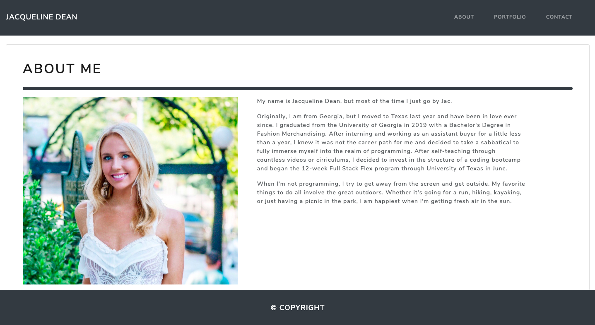
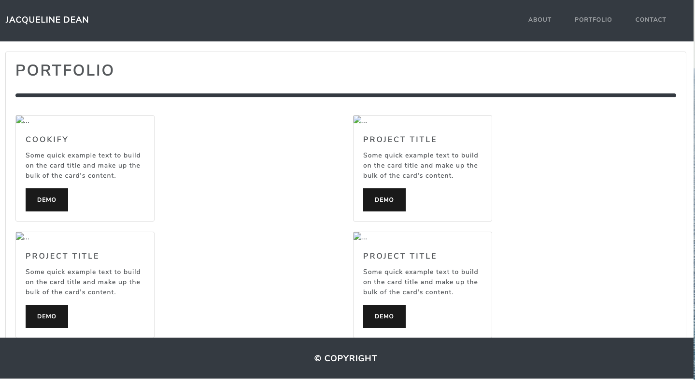
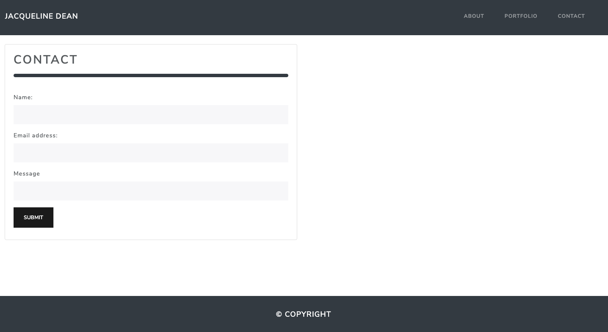

# CSS and Bootstrap Responsive Portfolio

Welcome to my portfolio webpage! I designed this webpage to highlight a little bit about myself, showcase several of my projects, and provide a way to get in touch with me. I hope you enjoy getting to know me and feel free to reach out. 
You can access my webpage [here](https://jacquelineadean.github.io/Portfolio-Bootstrap/).

## Demo 
The portfolio is comprised of three html pages: the home page, the portfolio page, and the contact page.
### The Home Page

### The Portfolio Page

### The Contact Page

## Technologies Used
For this portfolio, I incorporated Bootstrap and Bootswatch to style the html files. 

